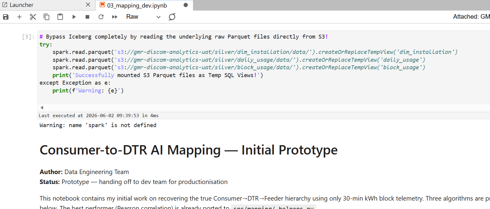

# Resume Generation RAG Application

A full-stack **Retrieval-Augmented Generation (RAG)** application that generates professional, anonymized resumes for **24 job categories** using real resume data, NVIDIA NIM LLMs, and ChromaDB vector storage.

The app includes a React UI with resume generation and an accuracy evaluation dashboard, plus a FastAPI backend with ingestion, retrieval, LLM generation, PDF export, and evaluation APIs.

---

## Features

- **24 professional categories** — resumes synthesized from real PDF datasets per category
- **RAG pipeline** — MMR retrieval from ChromaDB + CrossEncoder reranking
- **Universal resume template** — fixed section order, category-based designation (e.g. *Professional Healthcare Specialist*), anonymized placeholders
- **PII protection** — names, emails, phones, URLs, and dates removed or replaced during ingest and generation
- **PDF export** — formatted download via ReportLab (WeasyPrint when available)
- **Accuracy dashboard** — evaluate retrieval, category match, content, and privacy metrics per category or all 24 at once

---

## Project Structure

```
project-root/
├── data/data/                    ← 24 resume category folders (PDFs)
├── backend/
│   ├── app/
│   │   ├── main.py               ← FastAPI entry point
│   │   ├── config.py             ← Environment config
│   │   ├── api/                  ← Routes, schemas, evaluation routes
│   │   ├── services/             ← Ingest, retrieval, generation, PDF, sanitizer
│   │   ├── prompts/              ← LLM prompt templates
│   │   ├── templates/            ← HTML resume template
│   │   └── utils/                ← Helpers, category titles, logger
│   ├── evaluation/               ← Accuracy metrics & reports
│   ├── ingest.py                 ← Standalone ingestion script
│   ├── chroma_db/                ← Vector store (auto-created)
│   ├── generated_resumes/        ← PDF + text output (auto-created)
│   └── requirements.txt
├── frontend/                     ← React + Vite UI
├── .env.example
└── README.md
```

---

## Quick Start

### Prerequisites

- Python 3.10+
- Node.js 18+
- NVIDIA NIM API key → [build.nvidia.com](https://build.nvidia.com/)
- (Recommended) Hugging Face token → [huggingface.co/settings/tokens](https://huggingface.co/settings/tokens)

---

### 1. Configure Environment

```bash
# From project root (this folder)
copy .env.example .env
# Edit .env and set NVIDIA_API_KEY (and optionally HF_TOKEN)
```

---

### 2. Backend Setup

```bash
cd backend

# Create a virtual environment
python -m venv venv
venv\Scripts\activate          # Windows
# source venv/bin/activate     # macOS/Linux

pip install -r requirements.txt

# Run ingestion (one-time, builds the vector database)
cd ..
python backend/ingest.py

# Start the backend server
uvicorn backend.app.main:app --reload --host 0.0.0.0 --port 8000
```

> **Ingestion note:** First run processes all 24 category PDFs and builds ChromaDB. This typically takes 5–15 minutes depending on your machine. Use `INGEST_RESET_DB=true` in `.env` if you hit ChromaDB HNSW corruption errors, then re-run ingest.

---

### 3. Frontend Setup

```bash
cd frontend
npm install
npm run dev
```

| Service  | URL                        |
| -------- | -------------------------- |
| Frontend | http://localhost:5173      |
| Backend  | http://localhost:8000      |
| API docs | http://localhost:8000/docs |

---

## Using the App

### Generator tab

1. Select a category from the dropdown.
2. Click **Generate Resume**.
3. Preview the structured resume in the UI.
4. Click **Download PDF** for the formatted file.

Generated resumes use a universal template:

- **Header:** category designation only (no name or contact line)
- **Sections:** Professional Summary → Technical Skills → Work Experience → Projects → Education → Certifications → Achievements
- **Placeholders:** XYZ / ABC / DEF Company, XYZ University, anonymized certifications

### Accuracy tab

- **Evaluate Category** — run metrics for one category
- **All Categories (24)** — view a table of retrieval, category match, content, and privacy scores

Reports are cached under `backend/evaluation/reports/`.

---

## API Endpoints

### Core

| Method   | Endpoint                 | Description                    |
| -------- | ------------------------ | ------------------------------ |
| `GET`  | `/health`              | Backend health check           |
| `GET`  | `/categories`          | List all 24 categories         |
| `POST` | `/ingest`              | Run ingestion pipeline         |
| `POST` | `/generate-resume`     | Generate resume for a category |
| `GET`  | `/download/{filename}` | Download generated PDF         |

### Evaluation

| Method  | Endpoint                   | Description                   |
| ------- | -------------------------- | ----------------------------- |
| `GET` | `/evaluate/all`          | Evaluate all categories       |
| `GET` | `/evaluate/{category}`   | Evaluate one category         |
| `GET` | `/accuracy/report/all`   | Cached all-categories report  |
| `GET` | `/accuracy/report`       | Latest single-category report |
| `GET` | `/accuracy/cache/status` | Cache availability            |

### Example: Generate Resume

```bash
curl -X POST http://localhost:8000/generate-resume \
  -H "Content-Type: application/json" \
  -d "{\"category\": \"INFORMATION-TECHNOLOGY\"}"
```

---

## Architecture

```
PDFs → PII Cleaner → Chunker → Embedder → ChromaDB
                                              ↓
User selects category → MMR Retrieval → CrossEncoder Reranker
                                              ↓
                    NVIDIA NIM LLM → Sanitizer → Resume Text → PDF
```

**Key services**

| Service              | Role                                              |
| -------------------- | ------------------------------------------------- |
| `ingest_service`   | Parallel PDF processing and vector upsert         |
| `retriever`        | Category-filtered MMR retrieval                   |
| `reranker`         | CrossEncoder relevance scoring                    |
| `resume_generator` | Prompt build + NVIDIA NIM call                    |
| `resume_sanitizer` | Anonymization, date removal, template enforcement |
| `pdf_generator`    | Parse structured text → ReportLab / HTML PDF     |

---

## Privacy & PII

Personal information is removed or anonymized at ingest and again after LLM generation:

| Data                          | Handling                                                          |
| ----------------------------- | ----------------------------------------------------------------- |
| Names                         | Removed from output; no “Candidate” header in generated resumes |
| Emails                        | `[EMAIL]` (ingest) / stripped from final resume                 |
| Phone numbers                 | `[PHONE]` (ingest) / stripped from final resume                 |
| URLs (LinkedIn, GitHub, etc.) | `[URL]` (ingest) / stripped from final resume                   |
| Dates & tenure                | Removed (no years, ranges, or “X years experience”)             |
| Real companies / universities | Replaced with XYZ / ABC / DEF Company and XYZ University          |

---

## Categories

ACCOUNTANT, ADVOCATE, AGRICULTURE, APPAREL, ARTS, AUTOMOBILE, AVIATION, BANKING, BPO, BUSINESS-DEVELOPMENT, CHEF, CONSTRUCTION, CONSULTANT, DESIGNER, DIGITAL-MEDIA, ENGINEERING, FINANCE, FITNESS, HEALTHCARE, HR, INFORMATION-TECHNOLOGY, PUBLIC-RELATIONS, SALES, TEACHER

---

## Environment Variables

See `.env.example` for the full list. Important settings:

| Variable                                 | Purpose                                             |
| ---------------------------------------- | --------------------------------------------------- |
| `NVIDIA_API_KEY`                       | Required for resume generation                      |
| `NVIDIA_MODEL`                         | LLM model (default:`meta/llama-3.1-70b-instruct`) |
| `HF_TOKEN`                             | Faster Hugging Face model downloads                 |
| `DATA_PATH`                            | Resume PDF dataset location                         |
| `CHROMA_PERSIST_PATH`                  | ChromaDB storage                                    |
| `INGEST_PDF_WORKERS`                   | Parallel ingest workers                             |
| `INGEST_RESET_DB`                      | Wipe and rebuild ChromaDB on ingest                 |
| `RETRIEVAL_TOP_K` / `RERANKER_TOP_N` | Retrieval tuning                                    |
| `LLM_TEMPERATURE` / `LLM_TOP_P`      | Generation consistency                              |

---

## Tech Stack

- **Backend:** FastAPI, ChromaDB, sentence-transformers, CrossEncoder, ReportLab, NVIDIA NIM (OpenAI-compatible API)
- **Frontend:** React, Vite, Axios, Lucide icons
- **Data:** 24 category PDF corpora under `data/data/`

---

## Troubleshooting

| Issue                           | Fix                                                                                 |
| ------------------------------- | ----------------------------------------------------------------------------------- |
| ChromaDB HNSW / segment errors  | Set `INGEST_RESET_DB=true`, run `python backend/ingest.py`                      |
| Empty categories / no retrieval | Confirm ingest completed and `/health` shows chunks loaded                        |
| Backend unreachable in UI       | Start uvicorn from project root; check `VITE_API_URL` if not using localhost:8000 |
| Slow first generation           | Embedding and reranker models load on first request; subsequent runs are faster     |

---

## License

Internal / project use — see repository owner for licensing terms.
